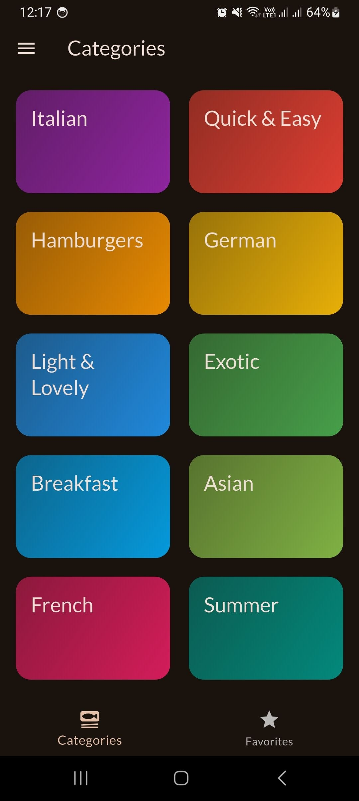
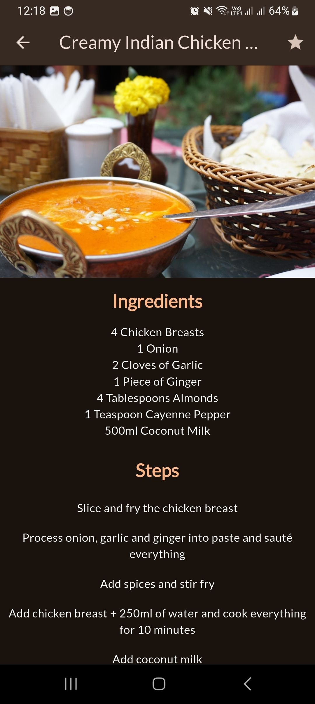
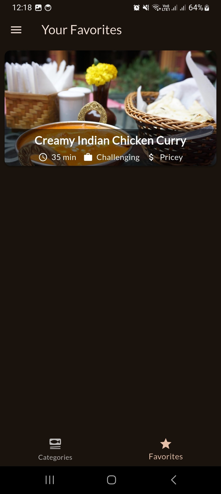
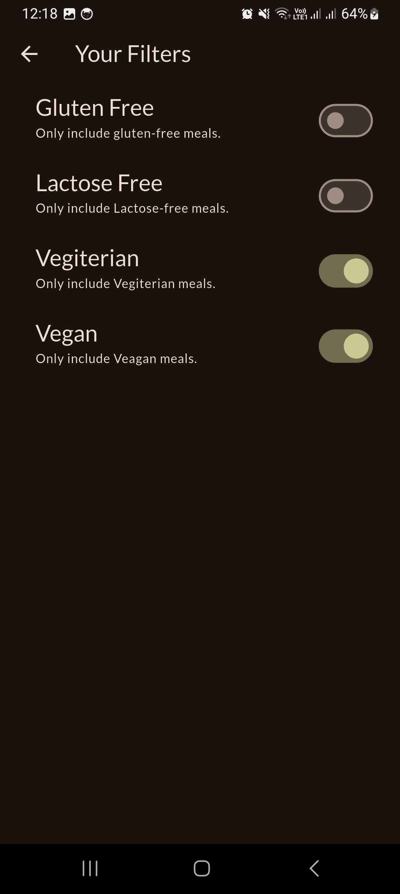
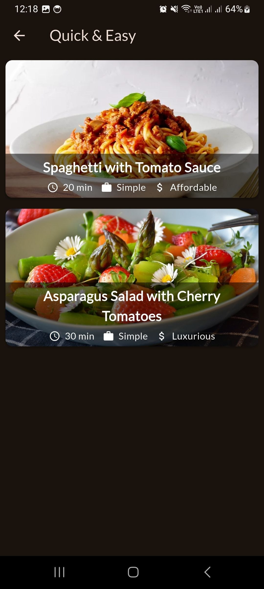

# 🍲 Recipe Explorer App

## 📌 Overview

Recipe Explorer is a cross-platform mobile application built with Flutter that allows users to discover recipes based on categories and dietary preferences. The app provides an intuitive and responsive user interface where users can browse meals, apply filters, and manage their favorite recipes efficiently.

This project demonstrates core mobile development concepts such as state management, UI composition, filtering logic, and user interaction handling.

---

## ✨ Features

### 📂 Category-Based Browsing

- Recipes are organized into multiple categories such as Italian, German, and more.
- Users can easily navigate through categories to explore different types of meals.

### 🥗 Advanced Filtering System

Users can filter recipes based on dietary needs:

- Vegan
- Vegetarian
- Gluten-free
- Lactose-free

The filtering system dynamically updates the displayed recipes based on selected preferences.

### ❤️ Favorites Management

- Users can mark recipes as favorites.
- A dedicated Favorites screen allows quick access to saved recipes.
- Demonstrates state synchronization across multiple screens.

### ⚡ Responsive UI

- Clean and structured layout
- Smooth navigation between screens
- Real-time UI updates when filters or favorites change

---

## 🛠 Tech Stack

- **Flutter** – UI toolkit for building natively compiled applications
- **Dart** – Programming language used for Flutter development
- **State Management** – (Riverpod / Provider)
- **Material Design** – For consistent UI components

---

## 🧠 Key Concepts Demonstrated

- State management and data flow
- Dynamic filtering logic
- Navigation between multiple screens
- List rendering and UI updates
- Separation of concerns (UI vs logic)

---

## 📸 Screenshots

## 📸 Screenshots

<a href="assets/images/home_page.jpg">
  
</a>
<a href="assets/images/meals_detail_page.jpg">
  
</a>
<a href="assets/images/favorites_page.jpg">
  
</a>
<a href="assets/images/filters_page.jpg">
  
</a>
<a href="assets/images/meals_list_page.jpg">
  
</a>

---

## 🌐 Live Demo

[live web demo](https://tubular-unicorn-223a32.netlify.app/)

---

## 📦 APK Download

[Apk File](https://drive.google.com/file/d/1aasi8HYCGeaH4h7O9KqHlgc73RnuWn6v/view?usp=drive_link)

---

## 🎥 Demo Video

(Add YouTube demo link here)

---

## 🚀 How to Run the Project

1. Clone the repository:

   ```bash
   git clone https://github.com/abdu2030/fifth_flutter_app.git
   ```

2. Navigate to the project folder:

   ```bash
   cd meals_app
   ```

3. Install dependencies:

   ```bash
   flutter pub get
   ```

4. Run the app:

   ```bash
   flutter run
   ```

---

## 📚 What I Learned

- Implementing state management for scalable applications
- Handling user interactions and updating UI dynamically
- Designing clean and user-friendly interfaces
- Structuring Flutter projects for better readability and maintenance

---

## 🔮 Future Improvements

- Persist favorites using local storage (SharedPreferences / Hive)
- Integrate backend or API for dynamic recipe data
- Add search functionality
- Improve UI/UX with animations and transitions
- User authentication and cloud sync

---

## 👤 Author

Abdulkerim Adem
abdulkerimadem453@gmail.com

---
